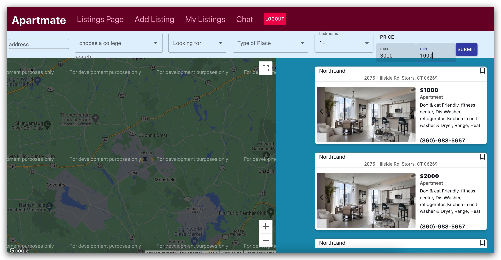
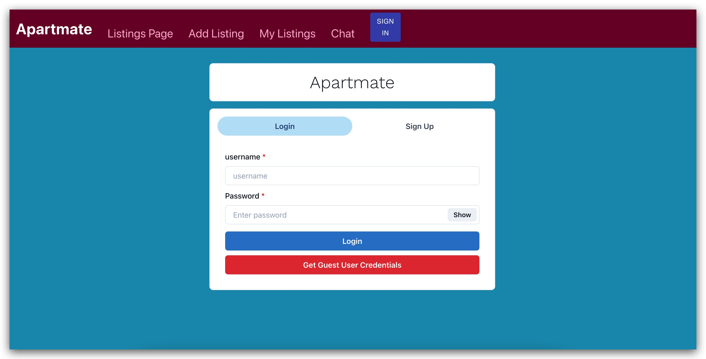
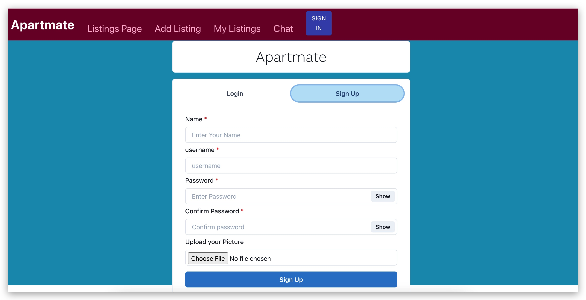
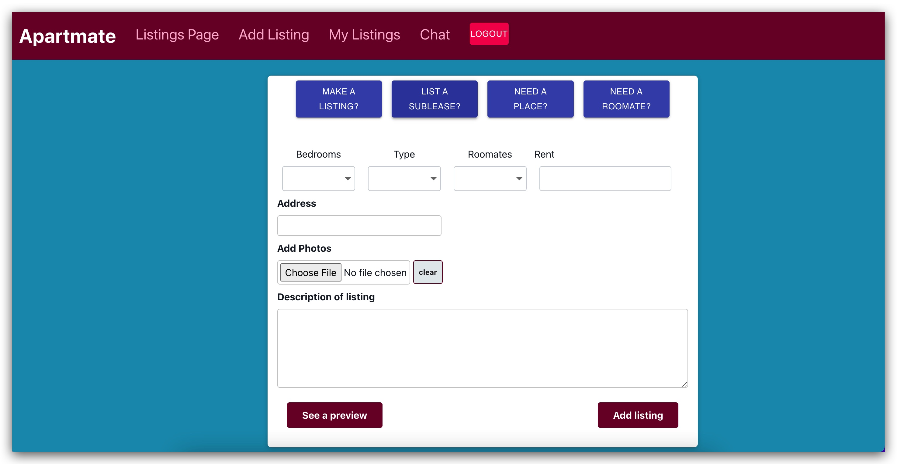
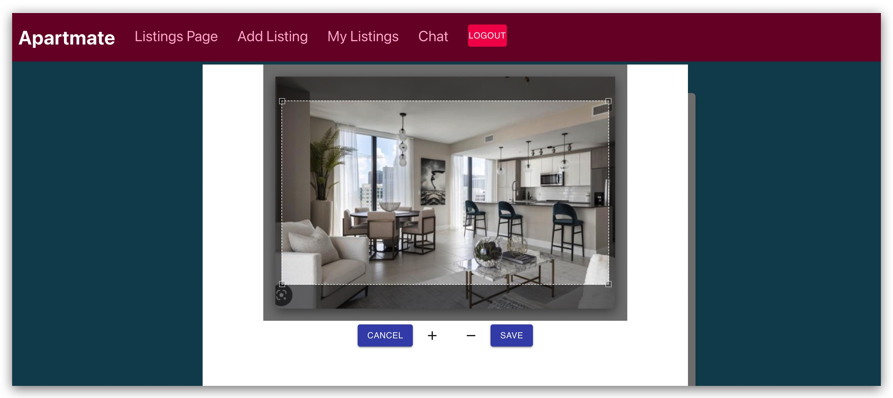
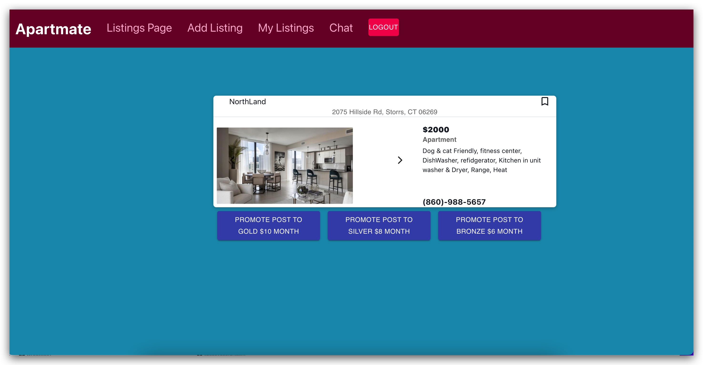
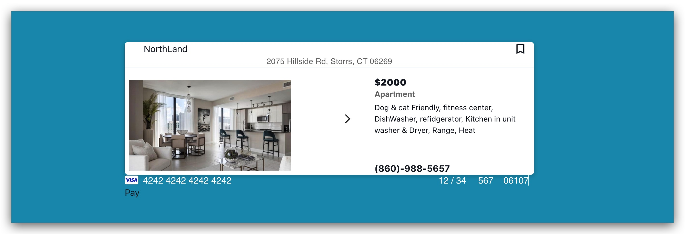
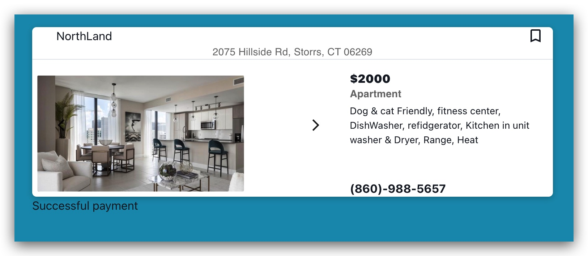
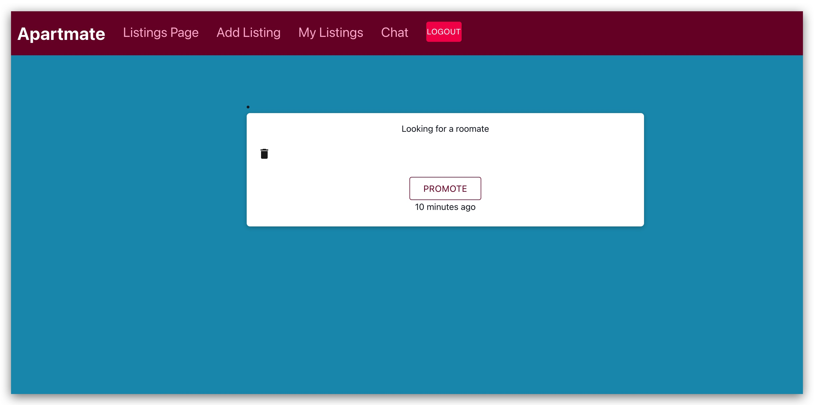

# Apartmate

Apartmate is a Full MERN Stack apartment website app.
allows user to post apartments for sale,sublease,look for roomates, promote post with strip Api. user details in encrypted format in Mongo DB Database.  Also uses Aws S3 bucket
## Tech Stack

**Client:** React JS

**Server:** Node JS, Express JS

**Database:** Mongo DB
  

## Run Locally


Go to the project directory

```bash
  cd apartmate
```

Install dependencies

```bash
  npm install
```

```bash
  cd frontend/
  npm install
```

Start the server

```bash
  npm start
```
Start the Client

```bash
  //open now terminal
  cd frontend
  npm start
```
Start the server
### filter apartments by location,price,bedrooms, college,Looking for roomate,Looking for place to live, House or condo or apartment


### sign in 

### sign up


### Add an apartment, Sublisting, or looking for a roomate
 


### crop image for apartments 


 ### promote post to the top


### Put in card information


### succsesfull card payment with stripe


### delete or promote post



  
